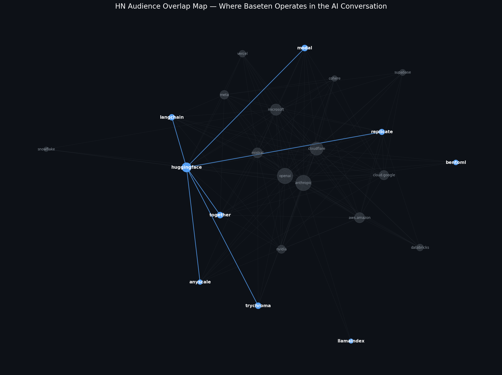

# HN Audience Map

**Where does the AI-infrastructure buyer actually live on Hacker News?** This repo maps audience overlap across 31 companies in the AI/data stack — Baseten, its competitors, the foundation-model providers, and the broader infra layer — using shared HN commenters as a proxy for shared audience.

## What this is

A small tool for B2B marketers to map where their buyers' attention actually clusters on Hacker News. It pulls 12 months of HN stories for a list of companies, identifies which commenters show up across multiple companies, and visualizes the resulting network — so you can see which competitors and adjacent tools share an audience before you spend money targeting them.

Originally built as a Reddit audience map. Reddit's 2023+ API restrictions made that impractical, so I pivoted to HN, the next-closest high-signal channel for a technical, infrastructure-buying audience.

## The headline finding

The infra cluster on HN routes through HuggingFace. Modal, Replicate, Together, and LangChain all share meaningful 'commenter' overlap with it. The foundation-model giants (OpenAI, Anthropic, Microsoft, AWS) dominate raw volume but cluster separately. And Baseten — the company this map is anchored on — doesn't appear on its own audience map at all, most likely due to the size or bandwidth of the marketing team at the time.

Full write-up with strategic implications: [ANALYSIS.md](ANALYSIS.md)

## Quick start

Requires Python 3.9+ and a terminal. Clone the repo, then:

\`\`\`bash
pip3 install requests pandas networkx matplotlib
python3 fetch_hn_data.py      # pulls 12 months of HN data (~45 min)
python3 compute_overlap.py    # computes audience overlap matrix (~30 sec)
python3 visualize_static.py   # generates hn_audience_map.png
\`\`\`

## Swap in your own market

Edit the \`DOMAINS\` list at the top of \`fetch_hn_data.py\` with the 20–40 companies you want to map. Then edit \`FOCUS_DOMAINS\` in \`visualize_static.py\` to highlight your specific cluster of interest. Re-run the three scripts. That's it.

## What's in here

| File | What it does |
|---|---|
| \`fetch_hn_data.py\` | Pulls HN stories + commenters per domain (Algolia API) |
| \`compute_overlap.py\` | Computes pairwise audience overlap (Jaccard + overlap coefficient) |
| \`visualize_static.py\` | Renders the focus-plus-context network map as PNG |
| \`data/hn_raw_data.json\` | Raw output: stories and commenters per domain |
| \`data/overlap_matrix.json\` | Computed: edges with shared-commenter counts |
| \`ANALYSIS.md\` | Strategic write-up of the findings |
| \`TUTORIAL.md\` | Step-by-step "build your own" walkthrough for non-coders |

## Method (short version)

- 12-month window of HN stories per domain (Algolia API, no auth required)
- Shared commenters across stories = proxy for shared audience
- Overlap coefficient used for edge weights (handles size disparity between OpenAI-tier and Baseten-tier domains)
- Spring layout for the network, with Baseten manually positioned even when isolated (the absence is the finding)

## Caveats

Shared commenters approximate shared audience, not causal influence. Some commenters are probably the companies themselves. HN skews toward a specific technical persona; this is one signal, not the whole market. The 12-month window matters — ideally, it would have been 6 months, but the 6-month cut missed slower-posting companies entirely. This is a directional map, not an attribution model.

## License

MIT. Fork it, swap the domains, and map your own market.
